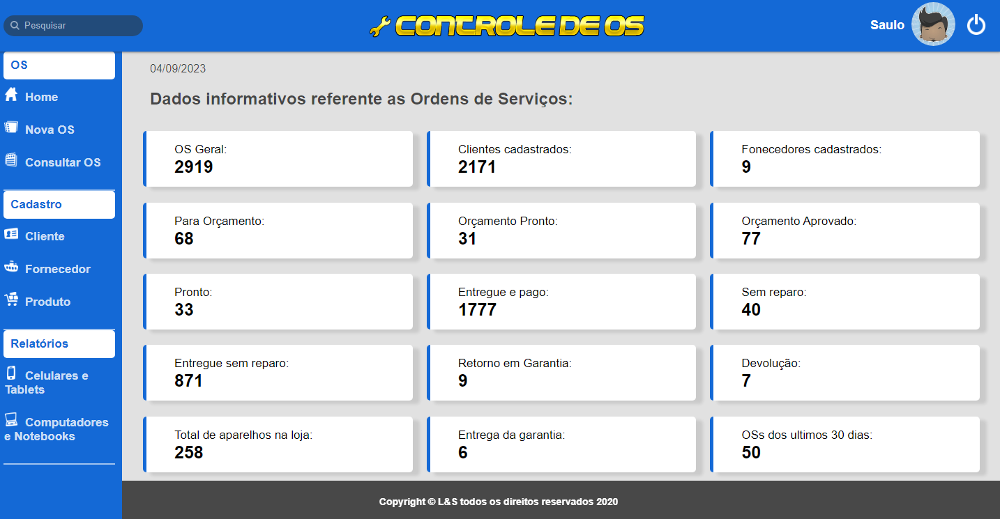
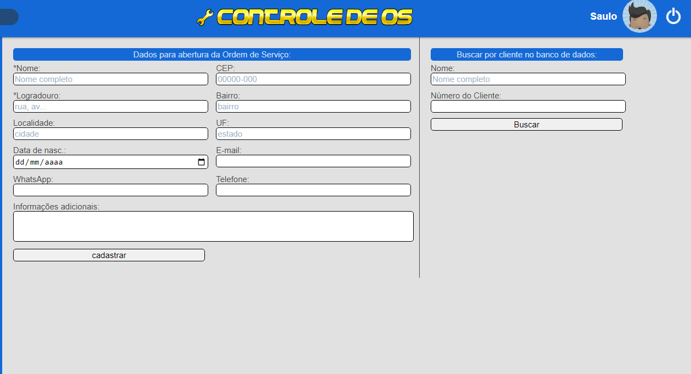
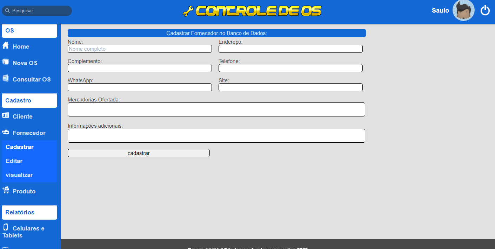
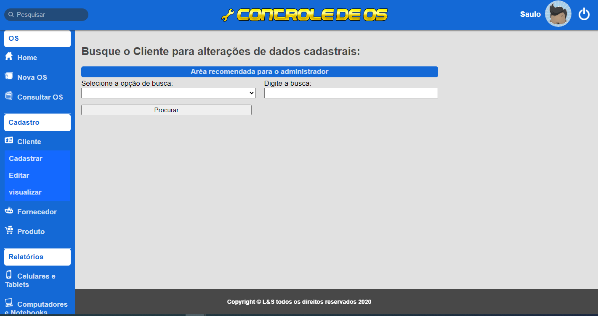
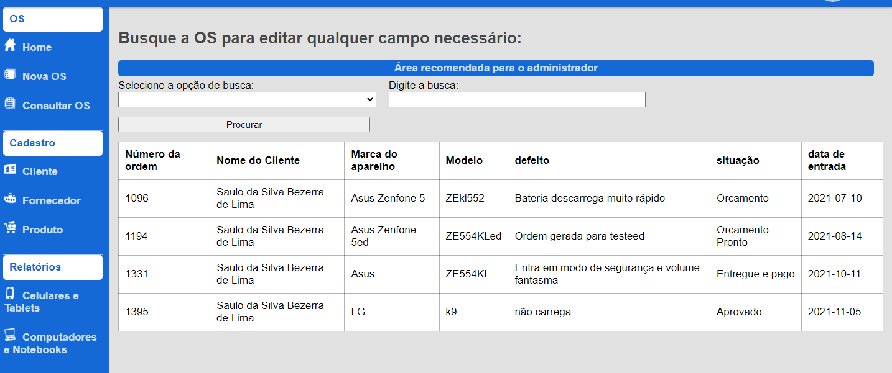
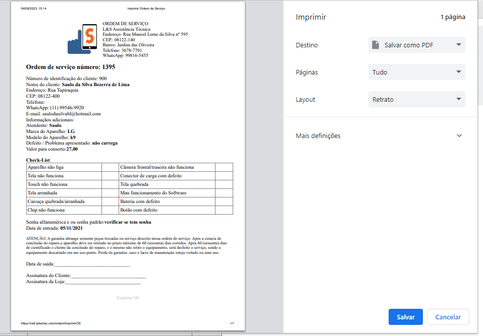

# Controle_de_Ordem_de_Servico
# Projeto iniciado em 04/2020
 
Este projeto foi criado para ser utilizado em uma Assistência Técnica de Celulares e Computadores, mas pode ser facilmente adaptado para qualquer outra assitência técnica. 
Está hospedado e em uso desde 2020.
O objetivo é gerenciar a manutenção, mostrando a quantidade e situação de cada equipamento: orçamento, orçamento pronto, orçamento aprovado, pronto, entregue e pago, sem reparo, entregue sem reparo, garantia, devolução, total de aparelhos na loja e OSs dos últimos 30 dias. 
Facilitar a entrada de informação, salvando os clientes e buscando-os para um nova OS.
Gerar e salvar o documento OS, ficando uma cópia com o cliente e outra com a loja.
Sistema foi feito em PHP estrutura MVC. 
O front-end foi feito em HTML, CSS e JS puro.
O sistema cabe muitas melhorias e novas funcionalidades, segue algumas fotos:

## Dashboard da página inicial, ao clicar em um dos boxes as informações aparecerão na tela.

## Cadastrar ou buscar pelo nome ou número de indentificação para gerar OS.  

## Cadastrar editar ou visualizar fornecedores.

## Cadastrar editar ou visualizar Cliente.

## OSs do cliente.

## Formato de OS gerada para impressão.
